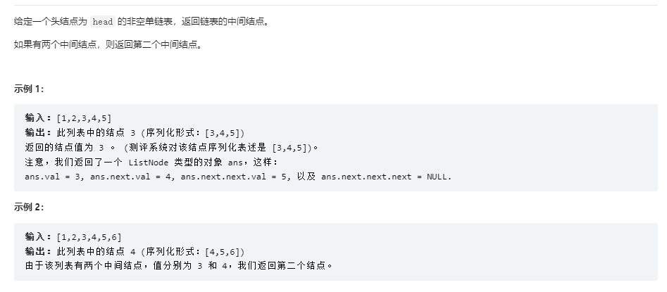
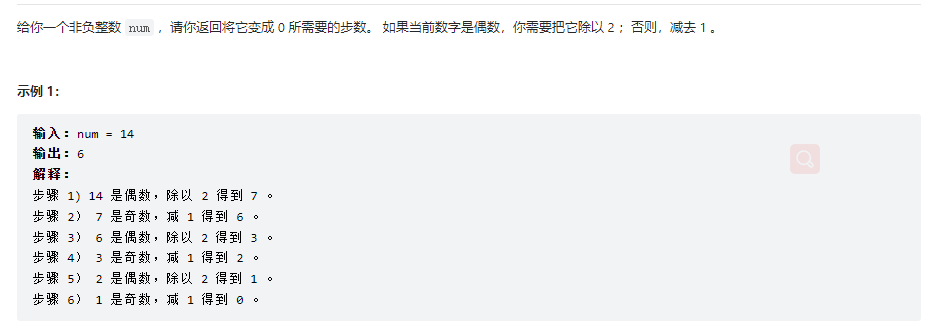

# leetcode

## [876链表转化为数组](https://leetcode.cn/problems/middle-of-the-linked-list/)

```c++
class Solution{
    public:
       ListNode* middleNode(ListNode* head) {
        vector<ListNode*> v;
        while(head!=nullptr){
            v.push_back(head);
            head=head->next;
        }
        return v[v.size()/2];
}
};
```
## [位运算判奇偶](https://leetcode.cn/problems/number-of-steps-to-reduce-a-number-to-zero/)


==奇数的二进制的低位一定是1==
1、i为10

1010&0001=0000

因此10&1=0不为1则10不是奇数

2、i为11

1011&0001=0001

因此11&1为1则11是奇数

```c++
class Solution{
    public:
      int numberOfSteps(int num){
        int ans=0;
        while(num>0){
            ans+=(num&1)+1;//（num&1）如果是奇数则进行一次减一，加一次右移操作
            num>>=1;
        }
        return max(ans-1,0);
      }
}
```

## [双指针用来给vector定长解决数组问题](https://leetcode.cn/leetbook/read/all-about-array/x9rh8e/)
```c++
class Solution {
public:
    void moveZeroes(vector<int>& nums) {
        int n=nums.size();
        int m=0;
        for(auto x : nums){
            if(x!=0){
                nums[m++]=x;
            }
        }
        while(m<n){
            nums[m++]=0;
        }
    }
};
```