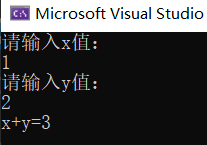

# 1. 句法
## 1.1. cin&&cout
C++ 中的输入与输出可以看做是一连串的数据流，输入即可视为从文件或键盘中输入程序中的一串数据流，而输出则可以视为从程序中输出一连串的数据流到显示屏或文件中。
```c++
#include <iostream>
using namespace std;
int Add(int x,int y){
    return x+y;
}
int main(){
    int x,y,z;
    cout<<"请输入x值："<<endl;
    cin>>x;
    cout<<"请输入y值："<<endl;
    cin>>y;
    z=Add(x,y);
    cout<<"x+y="<<z<<endl;
}
```


## 1.2. bool类型
在cpp中bool类型以旧和c中一样，返回0和1，占一个字节；
```c++
int main(){
    bool flag;
    int a,b;
    flag=a>b;
    cout<<"flag="<<flag<<endl;
}
```
输入3，4；flag=0；
输入3，2，flag=1；
也可以定义flag为false或true；
```c++
int main(){
    bool flag = true;
    if(flag){
        cout<<"true"<<endl;
    }else{
        cout<<"false"<<endl;
    }
    flag = false;
    if(flag){
        cout<<"true"<<endl;
    }else{
        cout<<"false"<<endl;
    }
    return 0;
}
```
输出true，false；
## 1.3. new&&delete
```c++
int *p=new int;//分配一个int型的内存空间
int *m=new int[10];//动态分配
delete p;//释放内存
delete[] m;
```
和 malloc() 一样，new 也是在堆区分配内存，必须手动释放，否则只能等到程序运行结束由操作系统回收。为了避免内存泄露，通常 new 和 delete、new[] 和 delete[] 操作符应该成对出现，并且不要和C语言中 malloc()、free() 一起混用。
## 1.4. inline内联函数
为了消除函数调用的时空开销，C++ 提供一种提高效率的方法，即在编译时将函数调用处用函数体替换，类似于C语言中的宏展开。这种在函数调用处直接嵌入函数体的函数称为内联函数（Inline Function），又称内嵌函数或者内置函数。

指定内联函数的方法很简单，只需要在函数定义处增加 inline 关键字。请看下面的例子：
```c++
#include <iostream>
using namespace std;
inline void swap(int *a,int *b){//函数定义
    int temp;
    temp=*a;
    *a=*b;
    *b=temp;
}
int main(){
    int m,n;
    cin>>m>>n;
    cout<<m<<","<<n<<endl;
    swap(&m,&n);//函数声明；
    cout<<m<<","<<n<<endl;
    return 0；
}
```
输入2，3输出3，2；
只能在函数定义出添加inline，函数声明出无效，当函数比较复杂时，函数调用的时空开销可以忽略，大部分的 CPU 时间都会花费在执行函数体代码上，所以我们一般是将非常短小的函数声明为内联函数。
## 1.5. c++函数重载
有时候我们需要实现几个功能类似的函数，只是有些细节不同。例如希望交换两个变量的值，这两个变量有多种类型，在C语言中，程序员往往需要分别设计出三个不同名的函数，其函数原型与下面类似；
```c++
void swap1(int *a, int *b);      //交换 int 变量的值
void swap2(float *a, float *b);  //交换 float 变量的值
void swap3(char *a, char *b);    //交换 char 变量的值
void swap4(bool *a, bool *b);    //交换 bool 变量的值
```
C++ 允许多个函数拥有相同的名字，只要它们的参数列表不同就可以，这就是函数的重载（Function Overloading）。借助重载，一个函数名可以有多种用途。
```c++
void swap(int *a,int *b){
    int temp;
    temp=*a;
    *a=*b;
    *b=temp;
}
void swap(float *a,float *b){
    int temp;
    temp=*a;
    *a=*b;
    *b=temp;
}
void swap(char *a,char *b){
    int temp;
    temp=*a;
    *a=*b;
    *b=temp;
}
void swap(bool *a,bool *b){
    int temp;
    temp=*a;
    *a=*b;
    *b=temp;
}
int main(){
    int m1=1,n1=2;
    float m2=1.0,n2=2.3;
    char m3='a,'n4='b';
    bool m4=true,n4=false;
    cout<<m1<<","<<n1<<endl;
    swap(m1,n1);
    cout<<m1<<","<<n1<<endl;
    cout<<m1<<","<<n1<<endl;
    swap(m2,n2);
    cout<<m2<<","<<n2<<endl;
    cout<<m2<<","<<n2<<endl;
    swap(m3,n3);
    cout<<m3<<","<<n3<<endl;
    cout<<m3<<","<<n3<<endl;
    swap(m4,n4);
    cout<<m4<<","<<n4<<endl;
}
```
==参数列表又叫参数签名，包括参数的类型、参数的个数和参数的顺序，只要有一个不同就叫做参数列表不同。==
### 1.5.1. c++是如何做到重载的？
C++代码在编译时会根据参数列表对函数进行重命名，例如void Swap(int a, int b)会被重命名为_Swap_int_int，void Swap(float x, float y)会被重命名为_Swap_float_float。当发生函数调用时，编译器会根据传入的实参去逐个匹配，以选择对应的函数，如果匹配失败，编译器就会报错，这叫做重载决议（Overload Resolution）。
## 类的定义
类是用户自定义的类型，如果程序中要用到类，必须提前说明，或者使用已存在的类（别人写好的类、标准库中的类等），C++语法本身并不提供现成的类的名称、结构和内容。
```c++
class Student{
    public:
    //成员变量
    char *name;
    char *sex;
    int age;
    float score;

    void say(){
        cout<<name<<"的年龄为"<<age<<endl;
    }
};
int main(){
    Student stu;
    stu.name='Wangxin';
    stu.age=22;
    stu.say()
    return 0;
}
Student Lilei;//创建对象
class Student Wangxin;//同样是创建对象
Student stu[100];//创建100个对象；该语句创建了一个 allStu 数组，它拥有100个元素，每个元素都是 Student 类型的对象。
```
分号表示一个类已经结束，Student类包含4个成员变量和一个成员函数
### 使用对象指针
上面代码中创建的对象 stu 在栈上分配内存，需要使用&获取它的地址，例如：
```c++
Student stu;
Student *pStu=&stu;
Student *qStu=new Student;
```
在栈上创建出来的对象都有一个名字，比如Wangxin，使用指针指向它不是必须的。但是通过 new 创建出来的对象就不一样了，它在堆上分配内存，没有名字，只能得到一个指向它的指针，所以必须使用一个指针变量来接收这个指针，否则以后再也无法找到这个对象了，更没有办法使用它。==也就是说，使用 new 在堆上创建出来的对象是匿名的，没法直接使用，必须要用一个指针指向它，再借助指针来访问它的成员变量或成员函数。==
有了对象指针后，可以通过箭头->来访问对象的成员变量和成员函数，这和通过结构体指针来访问它的成员类似，请看下面的示例：
```c++
pStu->name="王欣"；
pStu->age=22;
pStu->say();
```
==也可以把成员函数放外面，在类体中和类体外定义成员函数是有区别的：在类体中定义的成员函数会自动成为内联函数，在类体外定义的不会。==
```c++
void Student::say(){
    cout<<name<<"的年龄是"<<age<<"，成绩是"<<score<<endl;
}
inline void Student::say(){//内联函数；
    cout<<name<<"的年龄是"<<age<<"，成绩是"<<score<<endl;
}
```
## 类的访问权限
==类外只能访问public，类内public，protect，private可以互相访问==
```c++
#include <iostream>
using namespace std;
class Student{
    private:
    char *name;
    int age;
    float score;
    public:
    void setname(char *name);
    void setage(int age);
    void setscore(float score);
    void show();
}
//成员函数的定义
void Student::setname(char *name){
    m_name=name;
}
void Student::setage(int age){
    m_age = age;
}
void Student::setscore(float score){
    m_score = score;
}
void Student::show(){
    cout<<m_name<<"的年龄是"<<m_age<<"，成绩是"<<m_score<<endl;
}
int main(){
    //在栈上创建对象
    Student stu;
    stu.setname("王欣")；
    stu.setage(22);
    stu.setscore(92.5);
    stu.show();
    //在堆上建立对象
    Student *pStu=new Student;
    pStu->setname("梨花")；
    pStu->setage(22);
    pStu->setscore(92.3);
    pStu->show();
    return 0;
}
```
==成员变量大都以m_开头，这是约定成俗的写法，不是语法规定的内容。以m_开头既可以一眼看出这是成员变量，又可以和成员函数中的形参名字区分开==
## c++构造函数
在C++中，有一种特殊的成员函数，它的名字和类名相同,==没有返回值，不需要用户显式调用（用户也不能调用），而是在创建对象时自动执行==。这种特殊的成员函数就是构造函数（Constructor）。
```c++
class Student{
    private:
       char *m_name;
       float m_score;
        int m_age;
    public:
    //声明构造函数
    Student(char *name,int age,float score);
    //声明普通函数
    void show();
}
//定义构造函数
Student::Student(char *name, int age, float score){
    m_name = name;
    m_age = age;
    m_score = score;
}
void Student::show(){
    cout<<m_name<<"成绩为"<<m_score<<endl;
}
int main(){
    Student stu("王欣",22,99.8);//必须调用构造函数，不调用就出错
    stu.show();
    Student *pStu=new Studengt("王欣"，22，99.3)；
    pStu->show();
    return 0;
}
```
### 构造函数的重载
==构造函数的调用是强制性的，一旦在类中定义了构造函数，那么创建对象时就一定要调用，不调用是错误的。如果有多个重载的构造函数，那么创建对象时提供的实参必须和其中的一个构造函数匹配；反过来说，创建对象时只有一个构造函数会被调用。==
```c++
class Student{
    private:
       char *m_name;
       float m_score;
        int m_age;
    public:
    //声明构造函数
    Student(char *name,int age,float score);
    Student();
    //声明普通函数
    void setname(char *name);
    void setage(int age);
    void setscore(float score);
    void show();
}
//定义构造函数
Student::Student(char *name, int age, float score){
    m_name = name;
    m_age = age;
    m_score = score;
}
Student::Student(){
    name=NULL;
    age=0;
    score=0.0;
}
void Student::setname(char *name){
    m_name = name;
}
void Student::setage(int age){
    m_age = age;
}
void Student::setscore(float score){
    m_score = score;
}
void Student::show(){
    cout<<m_name<<"成绩为"<<m_score<<endl;
}
int main(){
    Student stu("王欣",22,99.8);//必须调用构造函数，不调用就出错
    Student stu()
    stu.show();
    Student *pStu=new Studengt("王欣"，22，99.3)；
    pStu->show();
    //调用构造函数Student()
    Student *pstu = new Student();
    pstu -> show();
    pstu -> setname("李华");
    pstu -> setage(16);
    pstu -> setscore(96);
    pstu -> show();
    return 0;
}
```
==输出：王欣的年龄是22，成绩是99.3
成员变量还未初始化
李华的年龄是16，成绩是96==

构造函数Student(char *, int, float)为各个成员变量赋值，构造函数Student()将各个成员变量的值设置为空，它们是重载关系。根据Student()创建对象时不会赋予成员变量有效值，所以还要调用成员函数 setname()、setage()、setscore() 来给它们重新赋值
### 默认构造函数
如果用户自己没有定义构造函数，那么编译器会自动生成一个默认的构造函数，只是这个构造函数的函数体是空的，也没有形参，也不执行任何操作.

==一个类必须有构造函数，要么用户自己定义，要么编译器自动生成。一旦用户自己定义了构造函数，不管有几个，也不管形参如何，编译器都不再自动生成==
```c++
Student(){}
```
## 析构函数
创建对象时系统会自动调用构造函数进行初始化工作，同样，销毁对象时系统也会自动调用一个函数来进行清理工作，例如释放分配的内存、关闭打开的文件等，这个函数就是析构函数。

==析构函数（Destructor）也是一种特殊的成员函数，没有返回值，不需要程序员显式调用（程序员也没法显式调用），而是在销毁对象时自动执行==构造函数的名字和类名相同，而析构函数的名字是在类名前面加一个~符号

注意：析构函数没有参数，不能被重载，因此一个类只能有一个析构函数。如果用户没有定义，编译器会自动生成一个默认的析构函数。

```c++
#include <iostream>
using namespace std;
class VAL{
    public:
       VAL(int len);//构造函数
       ~VAL();//析构函数
    public:
       void input();
       void show();
    private:
       int *at(int i)//获取第i个元素的指针
    private:
       const int m_len;  //数组长度
       int *m_arr; //数组指针
       int *m_p;  //指向数组第i个元素的指针
}
```
## this 指针
```c++
#include <iostream>
using namespace std;
class Student{
    public:
      void setname(char *name);
      void setscore(float score);
      void setage(int age);
      void show();
    private:
      char *name;
      float score;
      int age;
}
void Student::setname(char *name){
    this->name=name;
}
void Student::setage(int age){
    this->age=age;
}
void Student::show(){
    cout<<this->name<<"的年龄是"<<this->age<<endl;
}
int main(){
    Student *pstu = new Student;
    pstu -> setname("李华");
    pstu -> setage(16);
    pstu -> show();
    return 0;
}
```
==this 只能用在类的内部，通过 this 可以访问类的所有成员，包括 private、protected、public 属性的。成员函数的参数和成员变量重名，只能通过 this 区分==

this 虽然用在类的内部，但是只有在对象被创建以后才会给 this 赋值，并且这个赋值的过程是编译器自动完成的，不需要用户干预，用户也不能显式地给 this 赋值。

this 是 const 指针，它的值是不能被修改的，一切企图修改该指针的操作，如赋值、递增、递减等都是不允许的。
this 只能在成员函数内部使用，用在其他地方没有意义，也是非法的。
只有当对象被创建后 this 才有意义，因此不能在 static 成员函数中使用（后续会讲到 static 成员）。

==this 实际上是成员函数的一个形参，在调用成员函数时将对象的地址作为实参传递给 this。不过 this 这个形参是隐式的，它并不出现在代码中，而是在编译阶段由编译器默默地将它添加到参数列表中。==

## 静态成员变量
==static 成员变量属于类，不属于某个具体的对象，即使创建多个对象，也只为变量分配一份内存，所有对象使用的都是这份内存中的数据。==
```c++
class Student{
    public:
      Student(char *name,float score,int age)；//声明构造函数
      static total;//静态变量
    private:
      char *name;
      float score;
      int age;
}
//通过类类访问 static 成员变量
Student::total = 10;
//通过对象来访问 static 成员变量
Student stu("小明", 15, 92.5f);
stu.total = 20;
//通过对象指针来访问 static 成员变量
Student *pstu = new Student("李华", 16, 96);
pstu -> total = 20；
```
static 成员变量必须在类声明的外部初始化！！！被 private、protected、public 修饰的静态成员变量都可以用这种方式初始化。
==static 成员变量的内存既不是在声明类时分配，也不是在创建对象时分配，而是在（类外）初始化时分配。反过来说，没有在类外初始化的 static 成员变量不能使用。==

## 静态成员函数
编译器在编译一个普通成员函数时，会隐式地增加一个形参 this，并把当前对象的地址赋值给 this，所以普通成员函数只能在创建对象后通过对象来调用，因为它需要当前对象的地址。

而静态成员函数可以通过类来直接调用，编译器不会为它增加形参 this，它不需要当前对象的地址，所以不管有没有创建对象，都可以调用静态成员函数。
```c++
class Student{
public:
    Student(char *name, int age, float score);
    void show();
public:  //声明静态成员函数
    static int getTotal();
    static float getPoints();
private:
    static int m_total;  //总人数
    static float m_points;  //总成绩
private:
    char *m_name;
    int m_age;
    float m_score;
};
int Student::m_total = 0;
float Student::m_points = 0.0;
Student::Student(char *name, int age, float score): m_name(name), m_age(age), m_score(score){
    m_total++;
    m_points += score;
}
void Student::show(){
    cout<<m_name<<"的年龄是"<<m_age<<"，成绩是"<<m_score<<endl;
}
//定义静态成员函数
int Student::getTotal(){
    return m_total;
}
float Student::getPoints(){
    return m_points;
}
int main(){
    (new Student("小明", 15, 90.6)) -> show();
    (new Student("李磊", 16, 80.5)) -> show();
    (new Student("张华", 16, 99.0)) -> show();
    (new Student("王康", 14, 60.8)) -> show();
    int total = Student::getTotal();
    float points = Student::getPoints();
    cout<<"当前共有"<<total<<"名学生，总成绩是"<<points<<"，平均分是"<<points/total<<endl;
    return 0;
}
```
## 常成员函数（const成员函数）
```c++
class Student{
public:
    Student(char *name, int age, float score);
    void show();
    //声明常成员函数
    char *getname() const;
    int getage() const;
    float getscore() const;
private:
    char *m_name;
    int m_age;
    float m_score;
};
Student::Student(char *name, int age, float score): m_name(name), m_age(age), m_score(score){ }
void Student::show(){
    cout<<m_name<<"的年龄是"<<m_age<<"，成绩是"<<m_score<<endl;
}
//定义常成员函数
char * Student::getname() const{
    return m_name;
}
int Student::getage() const{
    return m_age;
}
float Student::getscore() const{
    return m_score;
}
```
getname()、getage()、getscore() 三个函数的功能都很简单，仅仅是为了获取成员变量的值，没有任何修改成员变量的企图，所以我们加了 const 限制，这是一种保险的做法，同时也使得语义更加明显。

## 友元函数和友元类
