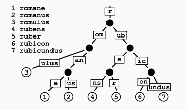

# 算法
## 1、radix tree
假如树中的一个节点是父节点的唯一子节点(the only child)的话，那么该子节点将会与父节点进行合并，这样就使得radix tree中的每一个内部节点最多拥有r个孩子， r为正整数且等于2^n(n>=1)。不像是一般的trie树，radix tree的边沿(edges)可以是一个或者多个元素。

不像是平常的树结构（在进行key的比较时，是整个key从头到尾进行比较），radix key在每个节点进行key的比较时是以bit组(chunk-of-bits)为单位来进行的，每一个chunk中的bit数目等于radix tree的基数r。
[radix tree](https://ivanzz1001.github.io/records/post/data-structure/2018/11/18/ds-radix-tree)
radix tree允许在O(k)的时间复杂度内进行查找、插入、删除等操作，而balanced trees在进行这些操作时时间复杂度一般为O(logn)。这看起来并不像是一个优势，因为通常情况下k>=log(n)，但是在平衡树中key的比较通常是字符串的完整比较，时间复杂度是O(k)，并且在实际使用过程中很多key可能还拥有相同的前缀。假如使用trie数据结构来进行存储，所有key的比较都是constant time，但是如果我们查询的字符串长度为m，那么也必须执行m次的比较。使用radix tree数据结构时，则需要更少的比较操作，并且使用的节点个数也更少。

当然，radix tree也与trie树一样有相同的劣势，然而：因为它们只能被应用于字符串元素或者能够高效映射为字符串的元素，它们缺少了平衡查找树那样的通用性，平衡查找树可以应用于任何类型以及任何比较顺序。
## 快排
### 一次快排
```c++
int [] arr={-1,2,3,4,5,6,7,1,12}
public int Sorting(int low,int high){
    arr[0]=arr[low];
    while(low<high){
        while(low<high && arr[high]>=arr[0]){
            high--;
        }
        arr[low]=arr[high];
        while(low<high && arr[low]<=arr[0]){
            low++;
        }
        arr[high]=arr[low];
    }
    arr[low]=arr[0];
    return 0;
}
```
### 递归实现多次快排
```c++
public void qsort(int low,int high){
    if(low<high){
        int pos=Sorting(low,high);
        qsort(low,pos-1);
        qsort(pos+1,high);
    }
}
```

### 更好的方法
```c++

void quickSort(int *array, int left, int right)
{
    if(NULL == array)
    {
        return;
    }
 
	if(left < right)
	{
		int pivot = array[left];
		int low = left, high = right;
		while(low < high)
		{
			while(array[high] >= pivot && low < high)
				high--;
			array[low] = array[high];
			
			while(array[low] <= pivot && low < high)
				low++;
			array[high] = array[low];
		}
		array[low] = pivot;
		
		quickSort(array, left, low - 1);
		quickSort(array, low + 1, right);
	}
}
```