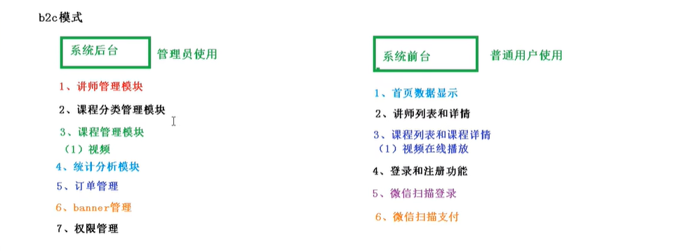
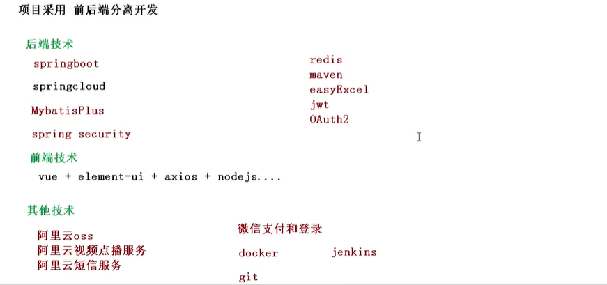
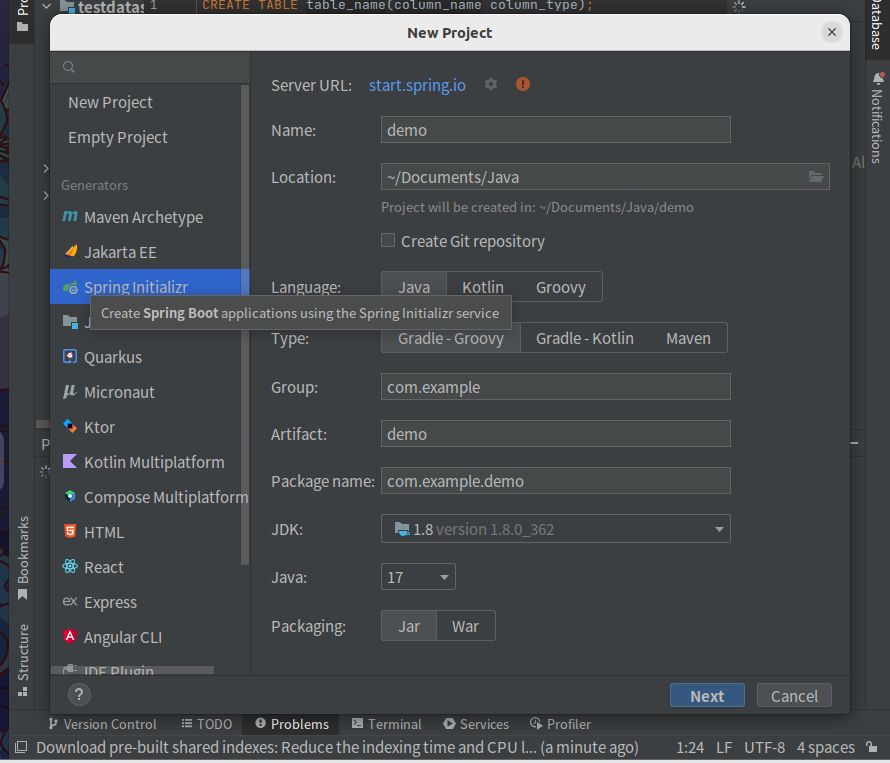
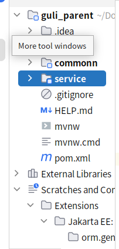

# 教育平台管理项目笔记
## 1、设计模式

## 2、技术栈

## springboot 项目创建

使用spring initializr

# 项目流程
## 创建父工程

canal-client：canal数据库表同步模块（统计同步数据）
common：公共模块父节点
common-util：工具类模块，所有模块都可以依赖于它
service-base：service服务的base包，包含service服务的公共配置类，所有service模块依赖于它
spring-security：认证与授权模块，需要认证授权的service服务依赖于它
infrastructure：基础服务模块父节点
api-gateway：api网关服务
service：api接口服务父节点
service-acl：用户权限管理api接口服务（用户管理、角色管理和权限管理等）
service-cms：cms api接口服务
service-edu：教学相关api接口服务
service-msm：短信api接口服务
service-order：订单相关api接口服务
service-oss：阿里云oss api接口服务
service-statistics：统计报表api接口服务
service-ucenter：会员api接口服务
service-vod：视频点播api接口服务

使用SpringInitializer 创建maven项目

pom文件写入依赖以及版本信息（使用maven版本2.2.1RELEASE），在下载相关依赖包前最好设置阿里云镜像，下载快。
## 搭建service模块

