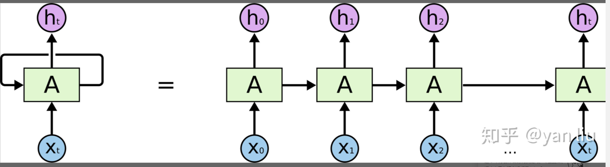
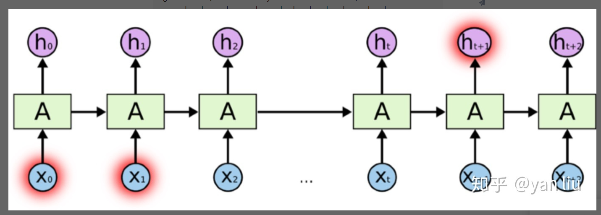
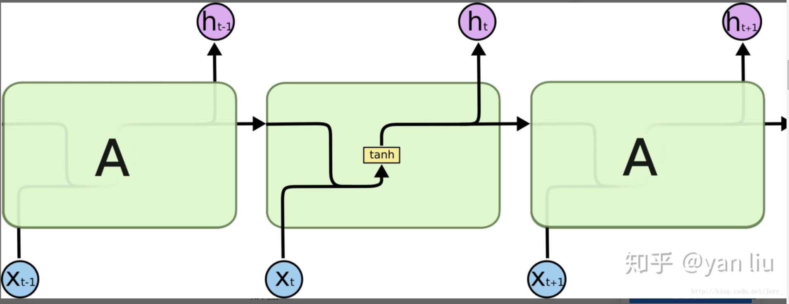
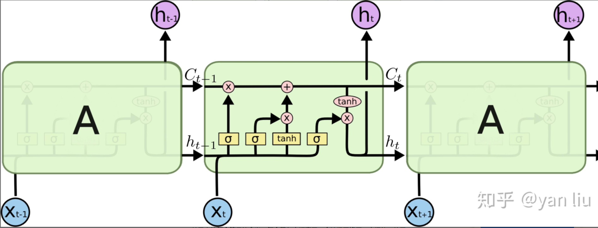
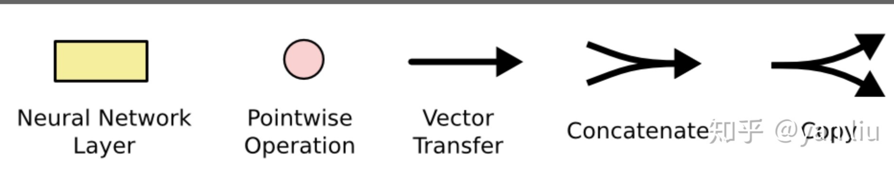
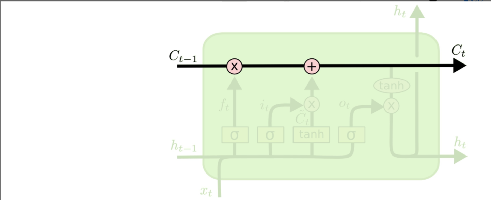
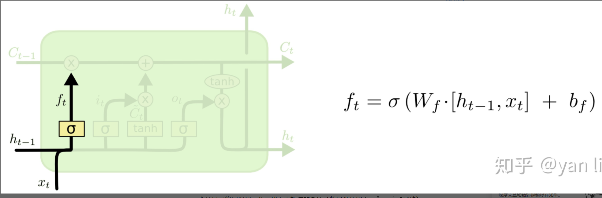
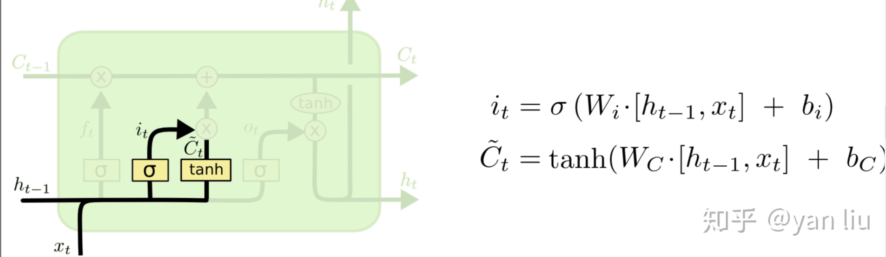

# Long Short Term Memory 记忆长短期神经网络
## 与传统RNN比较
在深度学习中，RNN处理时序问题，在t时间片是会将t-1时间片的隐节点作为当前时间片的输入，如下图的结构。这样有效的原因是之前时间片的信息也用于计算当前时间片的内容，而传统模型的隐节点的输出只取决于当前时间片的输入特征。



RNN的数学表达式：

$h_t=\partial(x_t*w_{xt}+h_{t-1}*w_{ht}+b)$

而传统的DNN的隐节点

$h_t=\partial(x_t*w_{xt}+b)$

对比RNN和DNN的隐节点的计算方式，我们发现唯一不同之处在于RNN将上个时间片的隐节点状态$h{t-1}$  也作为了神经网络单元的输入，这也是RNN擅长处理时序数据最重要的原因

==所以RNN的隐节点$h_{t-1}$有两个作用：

1.计算该时刻的预测值$y\hat{}_t:y\hat{}_t=\partial(h_t*w+b)$

2.计算下个时间片隐节点的状态$h_t$

## 长期依赖
在深度学习领域中（尤其是RNN），“长期依赖“问题是普遍存在的。长期依赖产生的原因是当神经网络的节点经过许多阶段的计算后，之前比较长的时间片的特征已经被覆盖。

```c++
eg1: The cat, which already ate a bunch of food, was full.
      |   |     |      |     |  |   |   |   |     |   |
     t0  t1    t2      t3    t4 t5  t6  t7  t8    t9 t10
eg2: The cats, which already ate a bunch of food, were full.
      |   |      |      |     |  |   |   |   |     |    |
     t0  t1     t2     t3    t4 t5  t6  t7  t8    t9   t10
```

was full 之中的was系动词取决于 cat ，而不是food

图1展示的RNN的结构，随着数据时间片的增加，RNN丧失了学习连接如此远的信息的能力（图2）。



## 梯度消失/梯度爆炸
梯度消失和梯度爆炸是困扰RNN模型训练的关键原因之一，产生梯度消失和梯度爆炸是由于RNN的权值矩阵循环相乘导致的，相同函数的多次组合会导致极端的非线性行为。梯度消失和梯度爆炸主要存在RNN中，因为RNN中每个时间片使用相同的权值矩阵。
### 梯度爆炸解决方法
处理梯度爆炸可以采用梯度截断的方法。所谓梯度截断是指将梯度值超过阈值$\theta$的梯度手动降到$\theta$。虽然梯度截断会一定程度上改变梯度的方向，但梯度截断的方向依旧是朝向损失函数减小的方向。
### 梯度消失的解决方法
对比梯度爆炸，梯度消失不能简单的通过类似梯度截断的阈值式方法来解决，因为长期依赖的现象也会产生很小的梯度。在上面例子中，我们希望$t_9时刻能够读到t_1时刻的特征，在这期间内我们自然不希望隐层节点状态发生很大的变化，所以[t_2,t_8]$时刻的梯度要尽可能的小才能保证梯度变化小。很明显，如果我们刻意提高小梯度的值将会使模型失去捕捉长期依赖的能力。
## LSTM!
LSTM提出的动机是为了解决上面我们提到的长期依赖问题。传统的RNN节点输出仅由权值，偏置以及激活函数决定（图3）。RNN是一个链式结构，每个时间片使用的是相同的参数。


而LSTM之所以能够解决RNN的长期依赖问题，是因为LSTM引入了门（gate）机制用于控制特征的流通和损失。对于上面的例子，LSTM可以做到在t9时刻将t2时刻的特征传过来，这样就可以非常有效的判断t9时刻使用单数还是复数了。LSTM是由一系列LSTM单元（LSTM Unit）组成，其链式结构如下图。



每个黄色方框表示一个神经网络层，由权值，偏置以及激活函数组成；每个粉色圆圈表示元素级别操作；箭头表示向量流向；相交的箭头表示向量的拼接；分叉的箭头表示向量的复制



LSTM的核心部分是在图4中最上边类似于传送带的部分（图6），这一部分一般叫做单元状态（cell state）它自始至终存在于LSTM的整个链式系统中。



其中$C_t=f_t*C_{t-1}+i_t*C_{*t}$

$f_t称为遗忘门，表示C_{t-1}的哪些特征被用来计算C_t.f_t是一个向量，$$向量的每个元素位于[0,1]之内。通常使用sigmoid作为激活函数，$$当你观察一个训练好的LSTM时，你会发现门的值绝大多数都非常接近0或者1，$$其余的值少之又少，其中\otimes是LSTM最重要的门机制，表示f_t和C_{t-1}之间的单位乘关系$


$C_{*t}表示单元状态更新值，由输入数据x_t和隐节点h_{t-1}$经由一个神经网络层得到，单元状态更新值的激活函数通常使用tanh.$i_t$叫做输入门，同时$f_t$一样也是一个元素介于[0,1]区间的向量，同样由$x_t和h_{t-1}$经由sigmoid激活函数计算而成。
