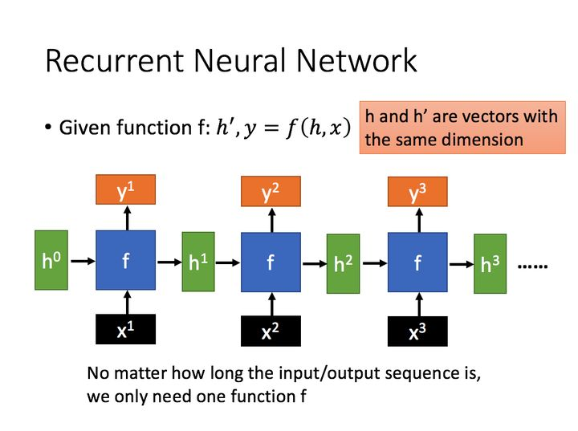
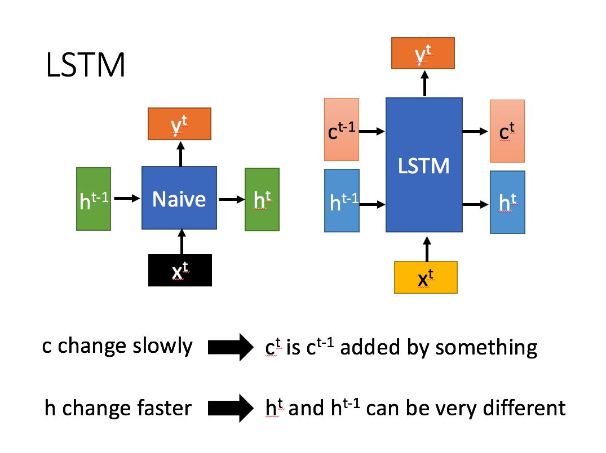

# 循环深度学习
### [参考网站](https://zhuanlan.zhihu.com/p/32085405)
1.循环神经网络（Recurrent Neural Network，RNN）是一种用于处理序列数据的神经网络。相比一般的神经网络来说，他能够处理序列变化的数据。比如某个单词的意思会因为上文提到的内容不同而有不同的含义，RNN就能够很好地解决这类问题

## LSTM
1。 什么是LSTM
长短期记忆（Long short-term memory, LSTM）是一种特殊的RNN，主要是为了解决长序列训练过程中的梯度消失和梯度爆炸问题。简单来说，就是相比普通的RNN，LSTM能够在更长的序列中有更好的表现。

## Transformer
[知乎专栏](https://zhuanlan.zhihu.com/p/48508221)

### Self-Attention和Transformer
[you](https://luweikxy.gitbook.io/machine-learning-notes/self-attention-and-transformer)