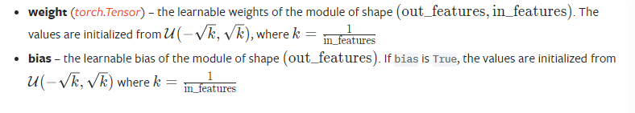

# 嵌入
torch.nn. 嵌入（num_embeddings， embedding_dim， padding_idx = None， max_norm = None， norm_type = 2.0， scale_grad_by_freq = False， sparse = False， _weight = None， _freeze = False， device = None， dtype = None）

一个简单的查找表，用于存储固定字典和大小的嵌入。

该模块通常用于存储词嵌入并使用索引检索它们。该模块的输入是一个索引列表，输出是相应的词嵌入。

参数：

    num_embeddings ( int ) C 嵌入字典的大小

    embedding_dim ( int ) C 每个嵌入向量的大小

    padding_idx ( int , optional ) C 如果指定，则条目padding_idx不影响梯度；因此，嵌入向量padding_idx在训练期间不会更新，即它保持为固定的“pad”。对于新构造的 Embedding，嵌入向量padding_idx将默认为全零，但可以更新为另一个值以用作填充向量。

    max_norm ( float , optional ) C 如果给定，每个范数大于的嵌入向量max_norm 被重新归一化为有范数max_norm。

    norm_type ( float , optional ) C 要为选项计算的 p 范数的 p max_norm。默认2。

    scale_grad_by_freq ( bool , optional ) C 如果给定，这将按小批量中单词频率的倒数来缩放梯度。默认False。

    sparse ( bool , optional ) C 如果True，梯度 wrtweight矩阵将是一个稀疏张量。有关稀疏梯度的更多详细信息，请参见注释。

变量：

    weight ( Tensor ) C 形状模块的可学习权重 (num_embeddings, embedding_dim) 从? ( 0 ,1 )

形状：

    输入：( * )，包含要提取的索引的任意形状的 IntTensor 或 LongTensor

    输出：
    （* ,H），其中*是输入形状和H=embedding_dim

# LINEAR
    torch.nn.Linear(in_features, out_features, bias=True, device=None, dtype=None)

对传入数据应用线性变换：$y=xA^T+b$

## 参数
    in_features ( int ) C 每个输入样本的大小

    out_features ( int ) C 每个输出样本的大小

    bias ( bool ) C 如果设置为False，该层将不会学习加性偏差。默认：True

## 形状

$
    输入：（*，H_{in}）*表示任意数量的维度，包括none和H{in}=infeatures
    输出（*，H_{out}）除了最后一个维度之外的所有维度都与输入的形状相同，H_{out}=outfeatures
$

## 变量

# Dropout
    torch.nn.Dropout(p=0.5, inplace=False)
p在训练期间，使用来自伯努利分布的样本以概率将输入张量的某些元素随机归零。每个通道都将在每次转发呼叫时独立清零。

正如论文Improving neural networks by preventing co-adaptation of feature detectors中所述，这已被证明是一种用于正则化和防止神经元共同适应的有效技术 。

此外，输出按比例缩放在 $1/(1-P)$训练中。这意味着在评估期间，模块只是计算一个恒等函数

## 参数

    p ( float ) C 元素归零的概率。默认值：0.5

    inplace ( bool ) C 如果设置为True，将就地执行此操作。默认：False

## 形状

    输入：( * ). 输入可以是任何形状

    输出：( * ). 输出与输入具有相同的形状

