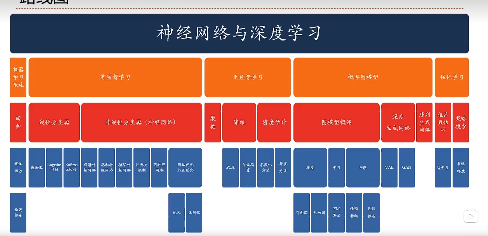

# 学习路线

## 卷积神经网络特点
1、局部链接
2、权重分享
3、空间或时间上的次采样
## 卷积
1、卷积经常用在信号处理中，用于计算信号和延迟累积。
2、假设一个信号发生器每个时刻t产生一个信号$X_t$,其信息衰减率为$W_k,即在K-1个时间步长后，信息为原来的W_k倍$
3、时刻t收到的信号$y_t为当前时刻产生的信息和以前时刻延迟信息的叠加$
### 卷积的作用
1、近似微分。
## 卷积神经网络
## 其他卷积种类
## 典型的卷积网络
## 卷积网络的应用
## 应用到文本数据