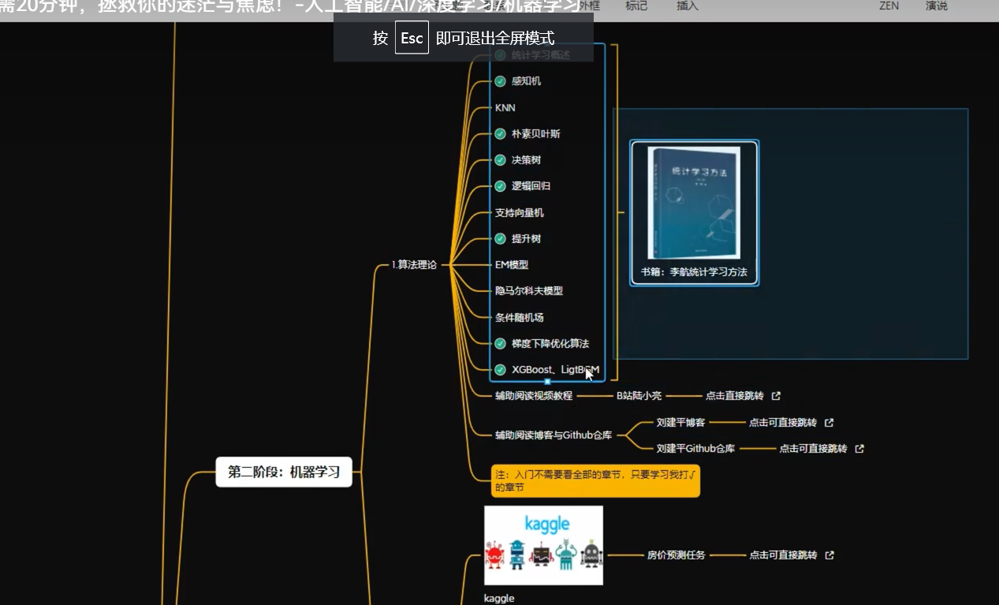

# 学习路线
[b站视频](https://www.bilibili.com/video/BV1QU4y1z7XQ?spm_id_from=333.1007.tianma.1-2-2.click&vd_source=8daa36909cd7542d77d128a60a6868c3)
[刘建平博客](https://www.cnblogs.com/pinard/)
## python
[python菜鸟教程](https://www.runoob.com/python/python-tutorial.html)
## 机器学习

## 项目推荐
1.kaggle 房地产预测
2.阿里云天池大赛
