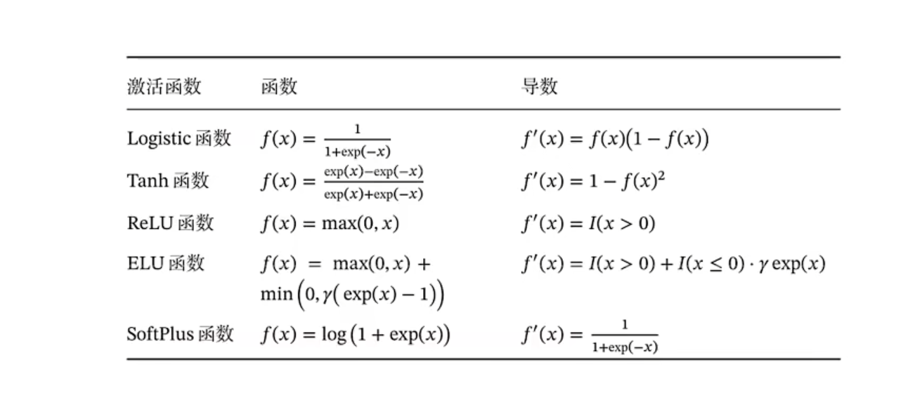
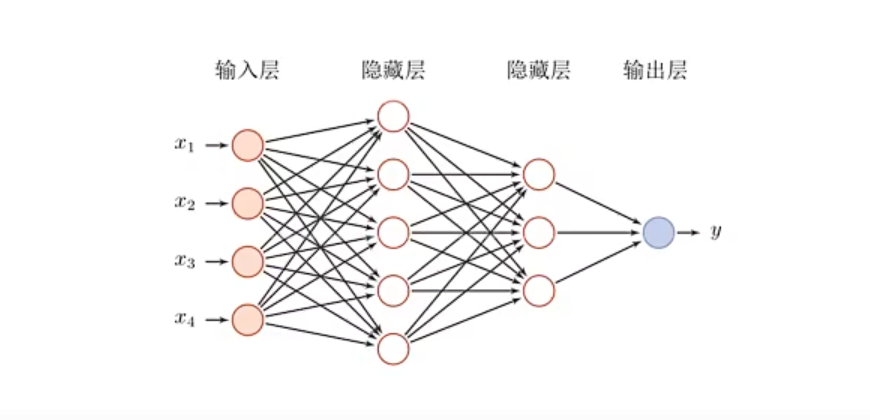
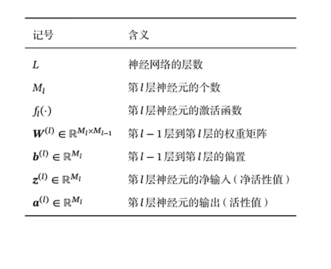
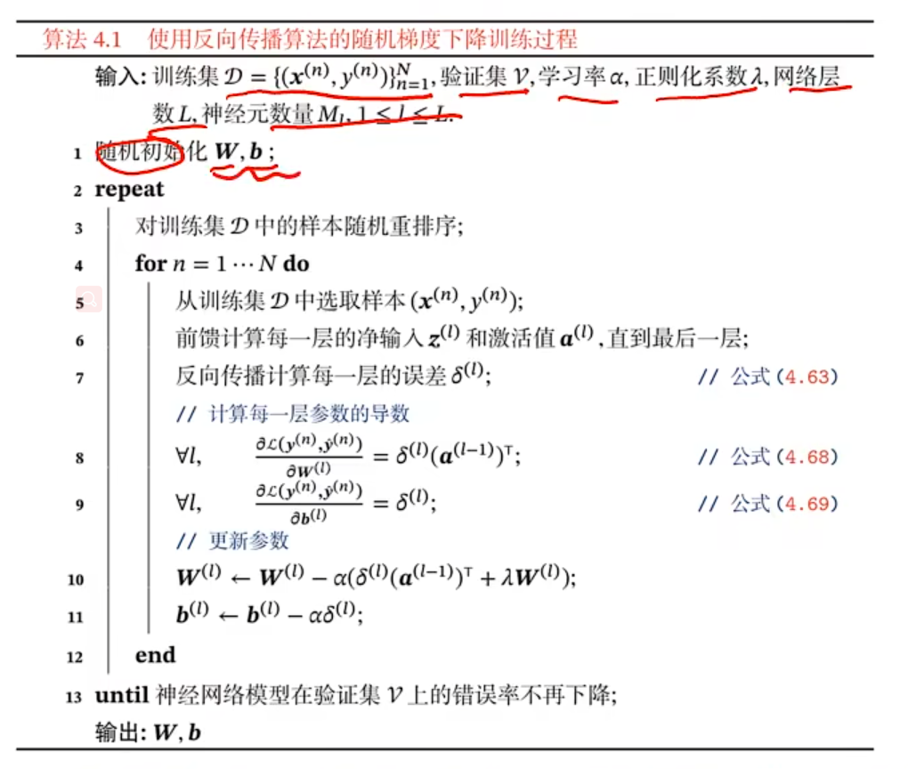
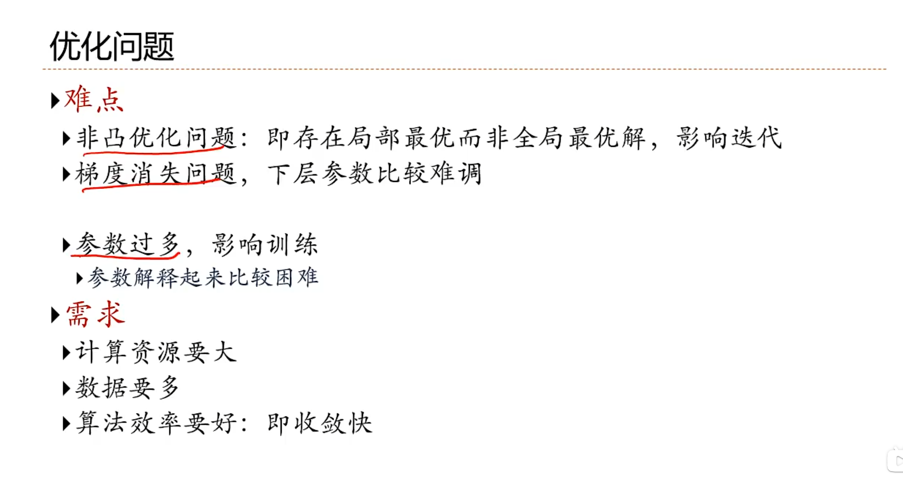

# 神经网络学习
注：$exp=e^x  log=log_e$ 
## 1、激活函数
### sigmoid函数(二分类逻辑斯蒂回归模型)
$
h(x)=\displaystyle\frac{1}{1+exp(-x)}
$
### softmax多分类逻辑斯蒂回归模型
$
y_k=\frac{exp(ak)}{\sum_{i=1}^nexp(a_i)}
$
==softmax函数的输出是0.0-1.0之间的实数，并且softmax函数的输出总和是1，正因为如此，我们可以把softmax的输出解释为“概率”==
### ReLU函数（斜坡函数）
**ReLU=max(0.x)**
优点：
1、计算上更高效；

2、生物学上更合理（单侧抑制，宽兴奋边界）；

3、在一定程度上缓解梯度消失等问题；

==泄露ReLU函数==

$$
LeakyReLU(x)=\begin{aligned}
\begin{cases}
x \quad if \ x > 0\\
\gamma x \quad  if \ x<=0
\end{cases}\\=max(0,x)+\gamma min(0,x)
\end{aligned}
$$
$
\gamma 是一个很小的参数。
$
## 2、常见的激活函数总结


## 3、损失函数
### 均方误差S
$
E=\frac{1}{2}\sum_{k}(y_k-t_k)^2
$
$

y_k表示神经网络的输出，t_k表示监督数据，k表示数据的维数。
$
假设有以下两种数据，
y=[0.1,0.05,0.6,0.0,0.05,0.1,0.0,0.1,0.0,0.0]
t=[0,0,1,0,0,0,0,0,0,0]
y是softmax函数的输出，t是监督数据，将正确标签设为1，其他为0。其中设“2”为正确，设为1，这种方法称为==one-hot编码==

```python
import numpy as np
def mean_squared_erro(y,t):
    return 0.5 * np.sum((y-t)**2)
# 设“2”为正确解
t=[0,0,1,0,0,0,0,0,0,0]

# 例1：“2”的概率最高的情况（0.6）
y=[0.1,0.05,0.6,0.0,0.05,0.1,0.0,0.1,0.0,0.0]
mean_squared_error(np.array(y),np.array(t))
#输出0.097500000000000031
# 例2：if softmax输出的概率最高的为“7”的情况：
y=[0.1,0.05,0.1,0.0,0.05,0.1,0.0,0.6,0.0,0.0]
mean_squared_error(np.array(y),np.array(t))
# 输出0.59750000000000003
```
第一个例子损失函数值更小，和监督数据之间的误差较小，因此更加吻合

### 交叉熵误差
$
E=-\sum_{k}t_klogy_k
$
```python
def cross_entropy_error(y,t):
    delta=le-7
    return -np.sum(t*np.log(y+delta))
```
## 4、线性回归
模型：$f(x;w,b)=w^Tx+b$
## 5、前馈神经网络
1、各神经元分别属于不同的层，层内无连接。

2、相邻两层之间的神经元全部两两连接。

3、整个网络中无反馈，信号从输入层向输出层单向传播，可用一个有向无环图表示。



==给定一个神经网络，用下面记号来描述这个网络：==



其中$L,M_1,f_1(·)$称为超参数。
## 使用反向传播算法的梯度下降训练过程

## 自动微分
### 前向模式
$\frac{\partial f(x:w,b)}{\partial w}=\frac{\partial f(x:w,b)}{\partial h_6}·\frac{\partial h_6}{\partial h_5}·\frac{\partial h_5}{\partial h_4}·\frac{\partial h_4}{\partial h_3}·\frac{\partial h_3}{\partial h_2}·\frac{\partial h_2}{\partial h_1}
·\frac{\partial h_1}{\partial w}
$

### 后向模式
$\frac{\partial f(x:w,b)}{\partial b}=\frac{\partial f(x:w,b)}{\partial h_6}·\frac{\partial h_6}{\partial h_5}·\frac{\partial h_5}{\partial h_4}·\frac{\partial h_4}{\partial h_3}·\frac{\partial h_3}{\partial h_2}·\frac{\partial h_2}{\partial b}
$

## 优化之间存在的问题


# 图的分类
同构图：在图里面，节点的类型和边的类型只有一种的图，举个例子，像社交网络中只存在一种节点类型，用户节点和一种边的类型，用户-用户之间的连边。

异构图：在图里面，节点的类型+边的类型>2的一种图，举个例子，论文引用网络中，存在着作者节点和paper节点，边的关系有作者-作者之间的共同创作关系连边，作者-论文之间的从属关系，论文-论文之间的引用关系。

属性图：图的节点上存在着初始属性attribute，可以用作后续节点的特征

动态图：图中的节点或者边都是随着时间变化的，可能增加或减少，一般是图的构成是按照时间片来构成，每一个时间片一个图的表示，例如t1
时刻的图是初始图，t2时刻的图就是节点或连边变化后的图一直到tn时刻

关系图：图表示了一种节点之间的隐含关系，举个例子 知识图谱
