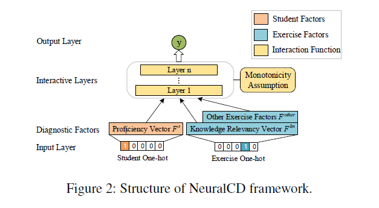
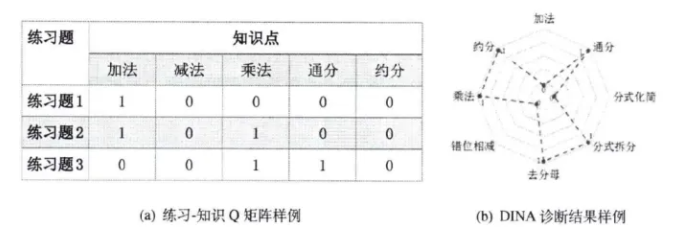

# Neural Cognitive Diagnosis for Intelligent Education Systems --王淇

## 提出了深度学习方法的认知诊断NeuralCD和NeuralCD+

## NeuralCD

    对于一个诊断系统需要考虑三个元素：学生因素，练习题因素，以及两者的互动。上图是NeuralCD的框架。

## NeuralCDM
NeuralCDM是NeuralCD框架下的一种模型，在NeuralCDM中，每个学生都用一个知识熟练度向量表示。

**Student factor** $F_s$是[(1，0)]表示学生对某个知识点的掌握程度，例如[(0.9,0.2)]则表示对第一个知识点掌握较好，但对第二个知识点掌握不足，下面用$h_s$表述。$h_s$是由学生的one-hot表示向量$x^s$和一个可训练向量矩阵A相乘所得。

$$\begin{matrix}
    h_s=sigmoid(x^s*A)
\end{matrix}$$
$h_s\in${0,1}$^{1*K}$,$x^s\in${0,1}$1*N$,$A\in R^{N*K}$

## 一种用于可解释认知诊断模型的新型定量关系神经网络 --杨昊文 sci一区 QRCDM  

1、矩阵分解，QRCDM类似于矩阵分解。

1.1 矩阵分解（MF）是一种常用于在推荐系统中对用户和项目进行建模的方法，许多研究人员证明了 MF 对学习者认知状态建模的可行性。在使用 MF 对学习者的认知状态进行建模时，将学习者视为用户，将练习视为项目，将他们在练习中的表现视为用户对项目的反应。
现有的矩阵分解虽然对预测学习者的习题表现有一定作用，但分解后矩阵中的特征与具体知识概念之间没有明确的对应关系 [7]，因此不适用于认知诊断。

    2.知识追踪
    知识跟踪（KT）用于通过单独跟踪每个学习者的知识状态来预测学习者在未来实践活动中的表现。
    知识追踪更关心的是预测学习者正确完成下一次练习的概率。最重要的是，知识概念在 MF 和 KT 中是非必要因素。

## 概括 
矩阵分解（MF）旨在通过学习者在练习的另一部分中的表现来预测学习者在练习的一部分中的表现。知识跟踪（KT）是一项跟踪学习者在过去各个阶段练习中表现的任务，以预测他们在未来练习活动中的表现。与 MF 不同，时间是 KT 中的一个重要因素。

认知诊断更关注获取学习者的认知状态。为了评估学习者的认知状态，根据实验中学习者的认知状态预测学习者正确完成下一个练习的概率。从机器学习的角度设计知识溯源模型尽可能准确地预测学习者正确回答下一题的概率。它不太关心学习者的认知状态，只要尽可能准确地预测学习者正确回答下一个练习题的概率即可，而知识追踪更关心预测学习者获得下一个练习题的概率练习锻炼权利。

现有的认知诊断模型很少充分利用习题与知识概念之间的隐含关系，对学习者的知识状态做出直观、可解释的诊断。因此，本研究提出了一种充分结合练习与知识概念之间显性和隐性关系的定量关系认知诊断模型

## 认知诊断和知识追踪的异同
认知诊断是新一代测量理论的代表，其目的是能够对学生个体围观知识层面进行评估分析，即得到学生在不同知识范围上的学习水平，最有代表的模型是（DINA,Q矩阵）该矩阵定义每一个练习题的知识范围, 由一组显示的知识/技能表示。
图 2.4(a)展示了一个Q矩阵的样例, 其中可以看出练习题 2 考察了 “加法” 和 “乘法” 两个知识点。在实际应用中Q矩阵通常由教育学专家 (如教师) 进行标注。

认知诊断是聚焦于学生目前对于某个知识点的掌握程度，主要讨论习题和知识之间的关系；
知识追踪是聚焦与学生对下次答对这类题目概率，两者讨论重点不一样；
之前的想法是用长短期记忆网络去预测学生下次答对这类题目的概率，这样重点就搞错了，而且已经有相关的论文（中文期刊）做出了研究DKT延申等；
对于认知诊断通常是从知识点和习题难度两个维度预测，我觉着可以加一个时间维度，对于不同时间的学生增加一个（熟悉度的维度，从学习该知识点时间和答题信心程度来分析），结合记忆曲线的时间节点，给出一个熟悉度的分数，最后再综合出该学生目前的知识层面。

矩阵分解（MF）旨在通过学习者在练习的另一部分中的表现来预测学习者在练习的一部分中的表现。知识追踪（Knowledge tracking，KT）是一项追踪学习者在过去各个阶段练习中表现的任务，以预测他们在未来练习活动中的表现。与 MF 不同，时间是 KT 中的一个重要因素。

认知诊断和知识追踪的区别在于它们的侧重点。认知诊断更关注获取学习者的认知状态。为了评估学习者的认知状态，根据实验中学习者的认知状态预测学习者正确完成下一个练习的概率。从机器学习的角度设计知识溯源模型尽可能准确地预测学习者正确回答下一题的概率。它不太关心学习者的认知状态，只要尽可能准确地预测学习者正确回答下一个练习题的概率即可，而知识追踪更关心预测学习者获得下一个练习题的概率练习锻炼权利。

此外，现有的认知诊断模型很少充分利用习题与知识概念之间的隐含关系，对学习者的知识状态做出直观、可解释的诊断。因此，本研究提出了一种充分结合练习与知识概念之间显性和隐性关系的定量关系认知诊断模型

    Matrix factorization (MF) aims to predict learners’ performance in one part of the exercises by the learners’ performance in another part of the exercises. Knowledge tracking (KT) is a task for tracking learners’ performance on exercises in various stages in the past to predict their performance in future exercise activities. Unlike the MF, time is an important factor in KT.

    The difference between cognitive diagnosis and knowledge tracing is their focus. Cognitive diagnosis is more concerned with obtaining the cognitive state of the learners. To evaluate the cognitive state of learners, the probability of learners getting the next exercise right was predicted based on the cognitive state of learners in the experiments. The knowledge tracing model was designed from the perspective of machine learning to predict the probability of learners’ correct answers to the next exercise question as accurately as possible. It is not very concerned about the cognitive state of learners as long as the probability of learners’ correct answers to the next exercise question was predicted as accurately as possible, whereas knowledge tracing is more concerned with predicting the probability that a learner will get the next practice exercise right.

    In addition, existing cognitive diagnosis models rarely make full use of the implicit relationship between exercises and knowledge concepts to make intuitive and interpretable diagnoses of learners’ knowledge states. Therefore, this study proposes a quantitative relationship cognitive diagnosis model that fully combines the explicit and implicit relationships between exercises and knowledge concepts.

虽然NeuralCDM和基于神经网络的知识追踪模型都利用了神经网络来进行教育评估，但它们之间还是存在一些区别。

NeuralCDM与传统的知识追踪方法最大的区别在于它不仅考虑学生的知识水平，还考虑了学生的认知能力。具体而言，NeuralCDM将学生的认知能力视为一种隐含因素，并使用神经网络来建立学生的认知诊断模型。这种模型可以对学生的认知能力进行建模和预测，并且可以在考虑学生认知能力的基础上更准确地估计学生的知识水平。

相比之下，基于神经网络的知识追踪模型通常更侧重于对学生的知识掌握情况进行建模和预测。这些模型通常使用神经网络来表示学生的知识状态，以便更好地估计学生的知识水平，并根据学生的历史数据预测学生的未来表现。

因此，NeuralCDM与基于神经网络的知识追踪模型之间的区别在于，NeuralCDM不仅考虑了学生的知识水平，还考虑了学生的认知能力，通过引入认知能力的概念，增强了模型的表达能力和泛化能力。

## 如何实现
长短期记忆网络，在某个不定的时间间隔t中输入同一个人的学习记录，对其加入变量诊断其知识结构，对于记忆曲线要是函数而不是固定值