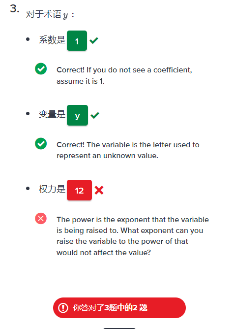
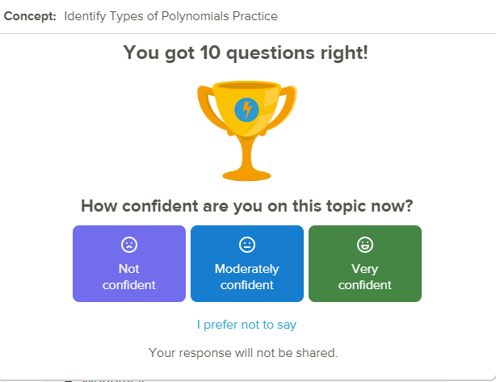
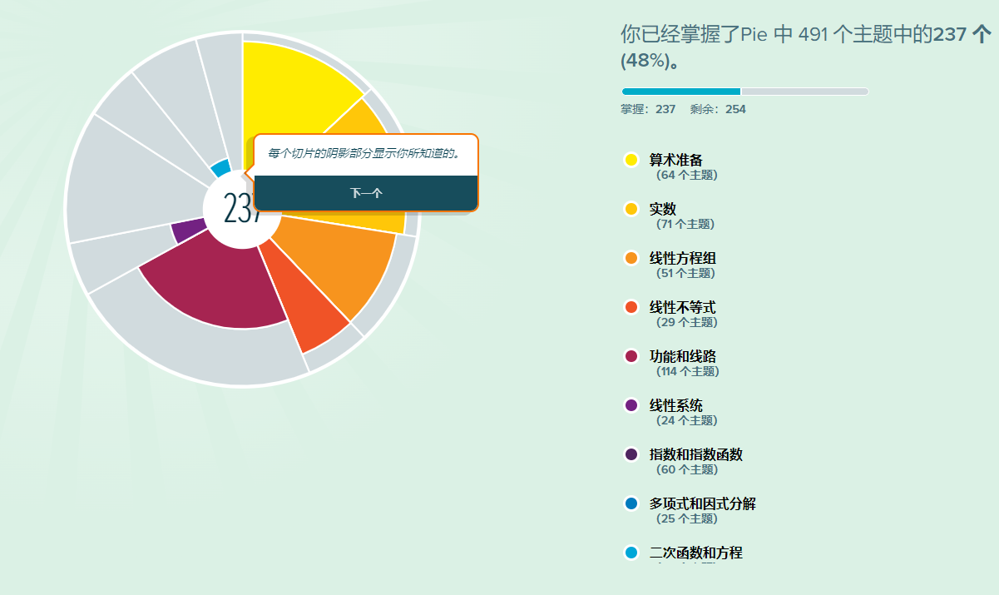
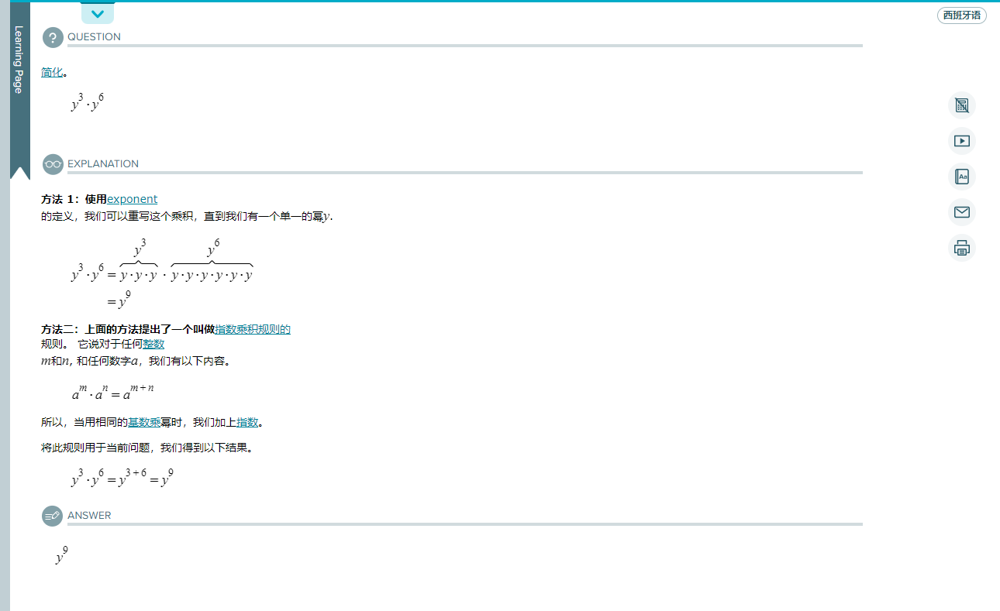
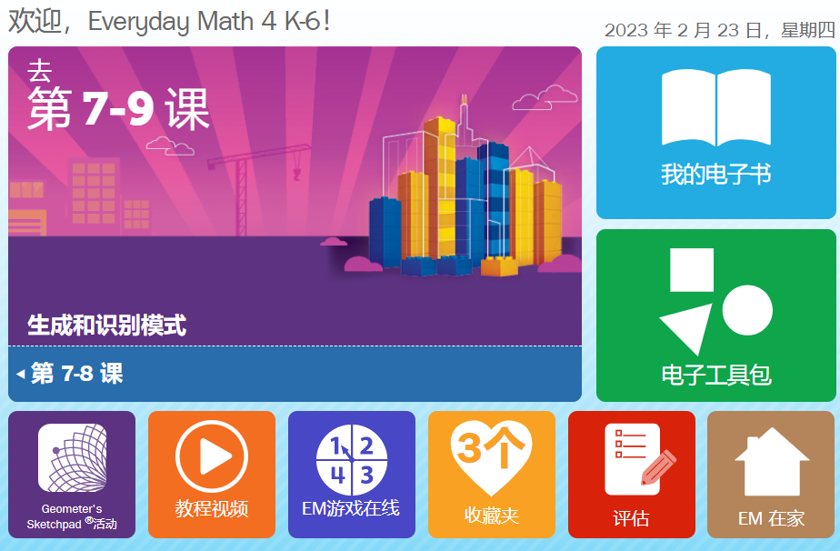
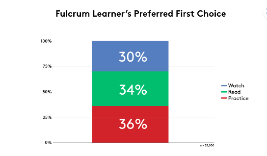

# 搜集的24种国外的不同自适应软件

## CK-12

    账号：gmail登录
CK-12为每一个学生提供一名导师Flexi，涵盖科目包括地球科学，生命科学，物理科学，生物学，化学，物理，数学，历史，语言类科目，下面以代数学为例：

    他会提供一本互动课本，进去后会提供老师课堂的ppt一样的内容，他会列举本节的学习目标等，然后对于每个知识点会有相应的例题，如：
 

    
    每一张后面会有对应练习，测试前他会问你的信心程度分为三级，不自信较为自信，非常自信，测试后会在出现一次，答题会有3次机会。最后统计正确率，他每一题目还带有相关提示。测试结束后会带有一个完整的答题情况复盘。

    优点：有相关内容提供并引导学习做到了像课堂一样，而且比起传统课堂更引人入胜一点
    缺点：没有自适应模块，对于不同用户学习的内容是完全相同的，不会根据用户的课堂答题情况进行内容以及学习路线的调整。
## Aleks

    账号：GUEST6852138
    密码：yxwarcv11..

进入该平台，系统会让你选择想要学习的相应知识，然后进入测试大概在20-30道题目，会中途停止，然后让你选择对这门课的了解程度，并给出一份诊断。

测试完成后会进入学习界面，他会给你一个实例讲解并且进入相似题目练习，如下图：

    他会生成一组5个题目，在不会的时候可以看解析，但这会影响这次学习的熟练度。
    优点：他会根据最一开始的测试为测试者提供学习路线，会自己生成相关内容题目，
    缺点：不能像CK-12一样提供一个完整的学习背景，往往陷入只会解题不会应用的情况。

## Learnsmart + Smartbook

    账号：em4reviewstudentMH
    密码：MathMH2022
以6年纪数学为例：

    感觉没什么参考价值

## SuccessMaker 
登录不了

    不仅会记录学生的进步，还会对其预测，随着时间的推移预测分析还可以帮助教师提高学生的成功率。
    交互式学习？

## Fulcrumlabs

    Fulcrumlabs提到了一种新的理论，叫做自适应3.0。
    当今许多自适应技术都坚持要用户遵循以下公式化路径：
 
        内容优先-�C在此途径中，所有用户都必须在进入学习实践或评估之前查看内容，无论其先前的知识或经验如何。这种方法对于先验知识很少的学习者来说很好，因为它允许他们在进入评估之前全面复习内容。但是对于已经了解材料的学习者来说，这种方法可能会导致非常负面的学习体验。通过强迫员工重复他们已经知道的信息，他们很快就会变得沮丧、不敬业和无聊――这可能会损害他们未来的表现，减慢他们的学习体验，并导致他们将培训（和未来的培训）视为“浪费时间”。

        问题优先�C在此途径中，所有用户都必须回答一系列问题，然后才能访问相应的内容。具有先验知识的学习者将能够完成评估问题并快速展示掌握情况。但对于几乎没有先验知识或经验的学习者来说，道路可能并不那么平坦。这些学习者可能会为他们根本不知道答案的问题而苦苦挣扎（因为他们还没有复习内容），导致他们感到气馁、焦虑和缺乏信心。

        此外，虽然有些学习者希望首先看到问题，但其他人更喜欢直接深入研究内容。事实上，我们发现学习者在我们的平台中选择的入学途径之间的细分相当均匀：

    这些架构迫使员工通过特定的途径进入学习计划，无论他们属于知识范围的哪个位置。
### 那么为什么要使用这些预设架构呢？

    许多自适应系统依赖于这些预设的路径，因为它们是通知系统用于适应内容的分支或算法所必需的。例如，基于高级算法的自适应系统可能会使用学习者对一组初始问题的回答来确定接下来需要呈现哪些内容。

    但我们正在进入一个自适应系统的新时代――我们称之为自适应3.0。在这个新时代，自适应技术正在利用人工智能和机器学习实时进行复杂的适应。这意味着新的自适应系统在设计入口架构方面具有更大的灵活性。随着系统从基于分支或高级算法的适应性转向更多支持人工智能的途径，他们将不再需要坚持要求学习者先回答一系列问题或复习内容，然后才能通过它。他们还可以自由地为员工提供更多机会来控制他们的学习的各个方面。

### 自适应选择的实际应用
    例如，我们的自适应平台利用尖端的人工智能和机器学习功能来为其适应提供信息。我们的系统不需要一组基本数据（例如，来自最初的一系列问题）来设计学习路径。相反，它使用实时分析来确定适合每个学习者的材料的深度和程度。

    因此，在我们的系统中，学习者从一开始就可以自由选择他们想要如何与学习互动。一旦学习者进入课程，他们就可以选择，例如，阅读内容、观看内容、直接进行练习评估或进行三者的组合。他们可以根据自己的经验、知识、时间限制和学习偏好设计自己的学习路径。

    如果学习者以前有该主题的经验，他们可以直接进入练习评估。他们不必浪费时间循环浏览他们已经知道的内容。相反，如果学习者的先验知识很少，他们可以花时间在阅读或观看方式中复习学习，然后再进入评估部分。

    这就是故事变得非常有趣的地方。通过允许学习者选择他们想要如何参与内容并规划自己的学习路径，我们的系统提供了惊人的学习效率。
