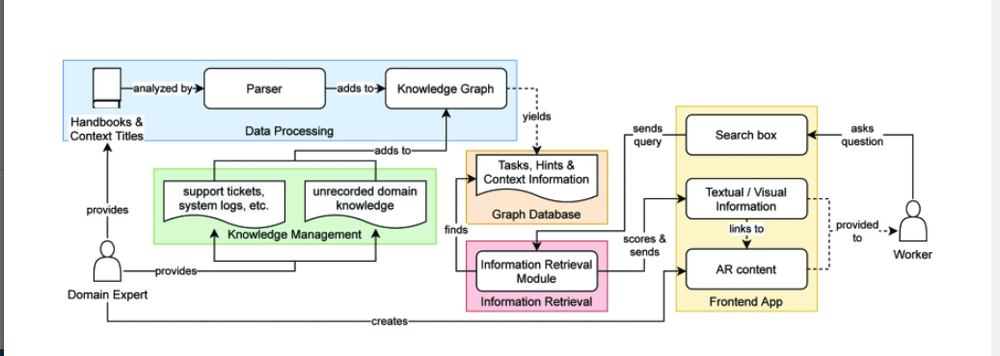

# 辅助系统的建模方法等

## 如何把已有的用户手册（经验）变为机器可学习的结构？？

### A.从用户手册构建图结构 
（1）[基于人工智能的制造辅助系统](https://ieeexplore.ieee.org/document/9921520)

领域知识以图形结构形式化，以便在数字助理系统中使用。在很大程度上，该图是根据从用户手册中聚合的知识自动构建的。除了 PDF 格式的用户手册外，领域专家还提供了上下文标题列表。每个上下文代表用户手册的重点主题之一。对于每个上下文标题，都会在图中创建一个节点。在 PDF 本身的处理过程中，会提取一组相关的文本段落并将其分类为以下两种类型之一：

任务：工作指导或制造步骤

提示：可以作为问题解决方案或有用的补充知识的附加信息

对于每个任务和提示文本段落，还会在图中创建一个节点，如果文本段落与相应上下文相关，则该节点将连接到一个或多个上下文节点。每个文本段落被提取为两个版本：

原始文本：没有任何格式和特殊字符的文本的简化形式。此版本用于提取后数据处理中的大多数步骤。

样式化 HTML：文本段落的生成 HTML 版本，其目标是尽可能接近 PDF 中版本的结构/样式。此版本用于在最终的 Assistant UI 中实际显示相应的文本段落。
### B.数据处理
为了从提供的用户手册和上下文元数据中实例化这种特定领域的知识图结构，PDF 文件要经过几个处理步骤。根据 PDF 的大小和各个步骤任务的复杂性，对于非常大的用户手册，单个处理步骤的执行可能需要几个小时。为了防止在处理大文件时阻塞整个系统，使用了通过中央消息队列管理的可扩展任务工作者架构。具体用户手册的领域特定知识图的实例化由以下子??任务组成：

PDF 提取：以原始文本形式以及 PDF 用户手册中的样式化 HTML 形式收集单个文本段落（包括表格、列表等），同时保留结构信息，如分离成（子）章节。图形也被提取并添加到相关的文本段落中，作为用户的附加上下文信息。

段落类型分类：使用预训练的循环神经网络将文本段落分类为三个类别任务、提示和不相关，这样可以丢弃不相关的文本，例如填充文本。

上下文分类：剩余任务和提示文本段落分配给 1 。. . n上下文标题，由领域专家为特定用户手册提供。分配任务被形式化为多标签分类问题。由于不同手册的上下文标题不同，因此分类模型无法预先训练，必须针对每个 PDF 处理请求进行训练。使用基于规则的上下文标题到文本段落匹配方法，可以从提取的段落中创建一组初始训练数据。这些训练数据通过几种方法人为地增强，以获得更大的数据集. 随后，神经网络将在之后使用增强数据进行训练。所有无法通过基于规则的方法分配的任务和提示段落都使用经过训练的神经网络分配给上下文标题。

信息检索索引：全文检索索引由信息检索系统的任务和提示段落构建，以便在数字助理系统中进行问答。
