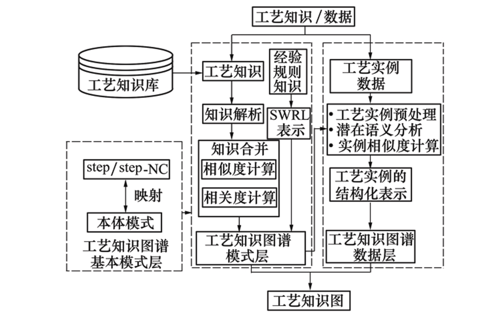
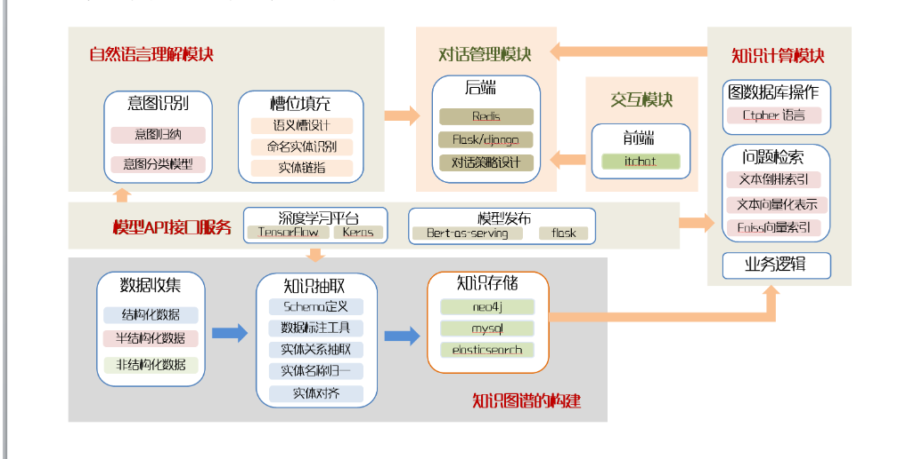
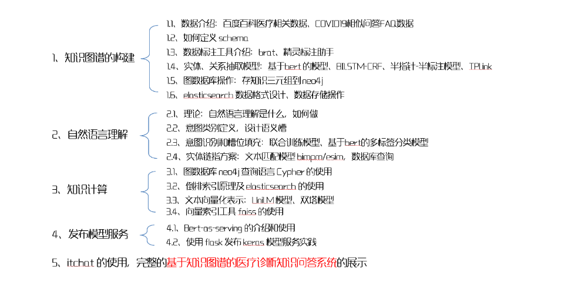

# [论文来源](https://www.jnwpu.org/articles/jnwpu/full_html/2019/06/jnwpu2019376p1174/jnwpu2019376p1174.html)

## 1.工艺知识分类

一般意义上的工艺知识其范围很广, 内涵也非常丰富。为了保证在数控工艺决策过程中快速、准确、及时地获得不同类型的工艺知识, 将数控工艺知识分为如下3类:

### 1) 规则类工艺知识

规则类工艺知识是从基于规则推理的角度描述工艺设计得以实现的依据, 是计算机可自动实现的工艺决策或推理。其主要来源于工艺设计手册、各类工程标准、专家经验知识等, 且是已经验证过正确的知识。目前主要依赖于人工总结。例如加工方法选择规则等, 这些知识对数控工艺决策具有重要的指导意义。

### 2) 共性工艺模板类工艺知识

共性工艺模板类是基于几何和工艺内容的相似性, 通过对出现频度较高的相似零件/局部结构/特征的加工工艺进行聚/分类生成的具有代表性、标准化的工艺知识。如对于材料为未淬火钢的孔, 其精度等级为8级, Ra为3.2 μm, 则加工方法为钻-扩-铰, 其本质为个性化实例知识。

### 3) 个性化工艺实例类工艺知识

个性化工艺实例类是已有规则和共性工艺模板类所未覆盖的特征/局部结构/零件的加工工艺个例, 即凡是库中存在的特征/局部结构/零件的加工工艺实例, 均可认为是个性化工艺实例知识。

## 1.2 工艺知识图谱构建的总体流程

### Step1  

工艺知识图谱模式层构建。首先在step-NC的基础上, 通过映射规则获得工艺知识图谱基本模式层(process knowledge graph basic schema, PKGBS); 其次通过工艺知识解析, 抽取工艺知识概念及关系, 并采用相似度和相关度计算, 得到工艺知识图谱扩展模式层(process knowledge graph extensive schema, PKGES); 最后利用SWRL(semantic web rule language)表征经验规则知识, 以完成工艺知识图谱模式层(process knowledge graph schema, PKGS)的构建;

### Step2

工艺知识图谱数据层的构建。在工艺知识图谱模式层的引导下, 利用潜在语义分析技术, 将加工工艺实例转化为结构化工艺知识图谱进行表示, 以实现工艺知识图谱数据层(process knowledge graph data, PKGD)的构建;

### Step3  

工艺知识图谱的生成。在前述的基础上, 完成工艺知识图谱的构建, 实现规则类与实例类工艺知识的统一结构化表征。

==如图一：==

# 如何构建知识图谱并搭建智能问答系统

## 1、开发环境

1、neo4j 图形数据库，用来搭建知识图谱

2、schema设计（包括实体-关系-实体）<丽江-属于-云南> <小明-喜欢-小红> <螺丝刀-安装-螺丝钉>

3、结构化数据集（含有实体标签，关系标签）

4、深度学习框架如pytorch，tensorflow，个人推荐pytorch，tensorflow因版本问题会有很多麻烦

5、神经网络模型、自然语言处理工具如jieba等

## 2、知识图谱搭建过程

### A、数据收集
a、结构化数据
b、半结构化数据
c、结构化数据

### B、知识抽取

1、Schema定义

2、数据标注工具

3、实体关系抽取

4、实体名称归一

5、实体对齐

### C、知识存储
neo4j，图形数据库
mysql，关系型数据库

## 知识计算模块
图形数据库操作 Ctpher语言

## 问题检索

文本倒排索引
文本向量化表示
Flask向量索引

## 模型API接口服务

深度学习平台 tensorflow/pytorch
模型发布 bert-as-serving flask

## 全部流程

