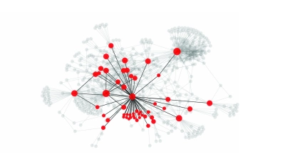

# 中观预测
## r-reachable graph
基于级联图和全局图的定义，我们可以定义一个从全局图中检索并命名为的子图r-reachable graph：
### 定义
给定全局图G G及其级联子图Gc, Gc的r -可达图定义为Grc={Vrc, Erc}，其中Vrc包含(1)Vc中的所有节点，(2)V G中的所有节点都在V c节点的r -跳范围内。例如，当r = 1时，vrc包含所有V c和V c中节点的所有近邻。

显示了一个示例r- 可达图（r=1)，其中暗节点及其交互形成级联图。r-可达图告诉我们有多少节点暴露给活动节点及其拓扑。建模背后的基本原理r可达图是高度暴露的节点可能会在未来将更多节点带入这个级联。
# 三个问题
(i)对于级联增长预测，我们可以达到多高的精度?如果我们不能改进基线猜测，那么这将是级联固有的不可预测性的证据。但如果我们可以显著改善这个基线，那么就有了一个非平凡预测的基础。在后一种情况下，了解使预测成为可能的特征也变得很重要。

(ii)增长预测是针对小级联还是针对大级联?换句话说，随着级联的展开，级联的未来行为是越来越可预测还是越来越不可预测?

(iii)除了级联的增长，我们能否预测其“形状”——即其网络结构?

## 想法
r-可到达图不如级联预测的一个主要原因是因为，建模比较麻烦，在级联图中的几十个节点在r-reachable图中却可能有成千上万个节点，那我一一对节点建模是很消耗计算力和内存的，那我按时间戳将直接将网络嵌入进去，